# OnlineSubsystemApple
this is a OnlineSubsystemApple plugin for unreal engine 4, both c++ and blueprint supported.

# Step1 - Edit your Unreal [[Platform]Engine.ini]
 ex) Config/Windows/WindowsEngine.ini
 
 [OnlineSubsystemApple.OnlineIdentityApple] 
 ClientId=com.onlinesubsystem.apple.service 
 LoginRedirectUrl=https://onlinesubsystem.azurewebsites.net/api/apple/redirect  
 CheckBackendUrl=https://onlinesubsystem.azurewebsites.net/api/apple/check  

# Step2 - Build on IOS. You have to config DefaultEngine.ini

 [/Script/IOSRuntimeSettings.IOSRuntimeSettings] 
 bEnableSignInWithAppleSupport=True

# Step3 - YourProject.Build.cs
  PublicDependencyModuleNames.Add("OnlineSubsystemApple");

# Step4 - Use In Blueprint
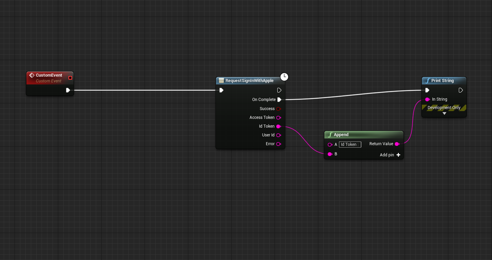

# Customize plugin, u have to registered Apple Developer Program.

 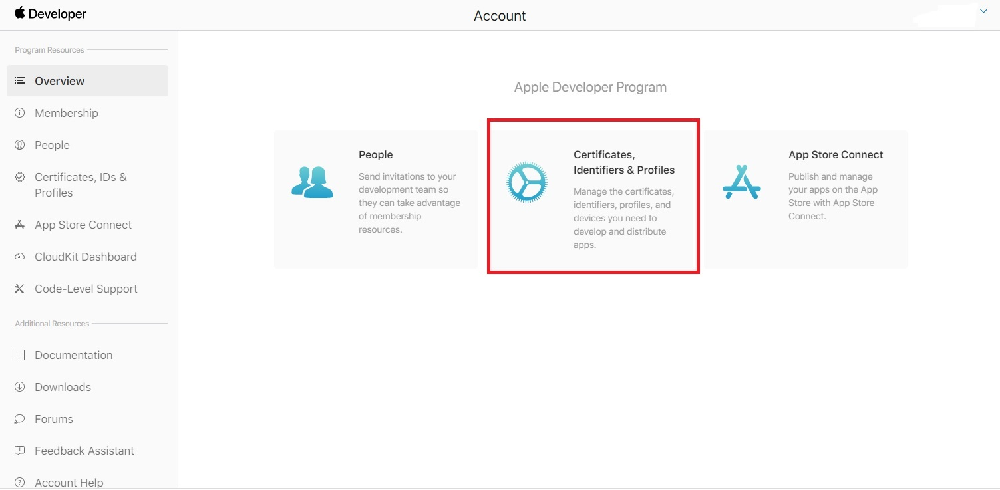

# Step1 - Create App Id
 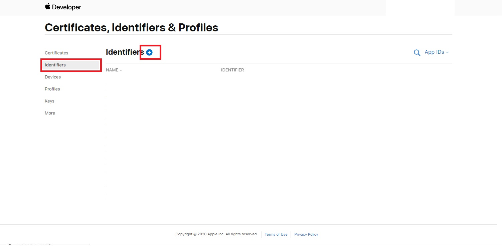

 ### Select App Ids and Countinue
 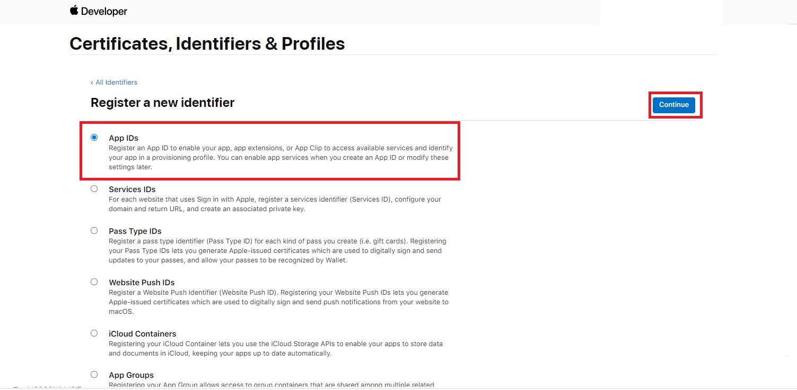

 Countinue
 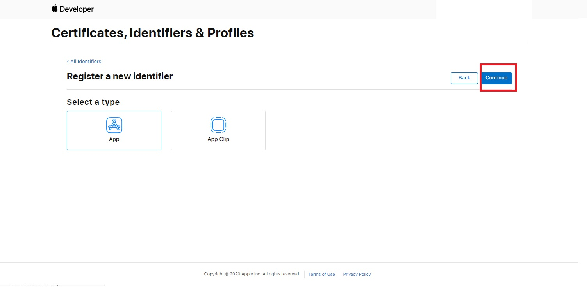

 ### Edit Description.
 ### Edit Bundle ID. example [com.onlinesubsystem.apple]
 ### Check Capabilities - Sign In with Apple. And Click Edit
 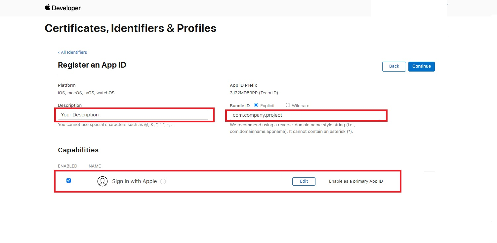

 ### Input ur Backend Notification Server URL.
 ### Apple callback when users change mail, delete account.. etc.
 ### This PlugIn provide default Notificate URL. "https://onlinesubsystem.azurewebsites.net/api/apple/notificate"
 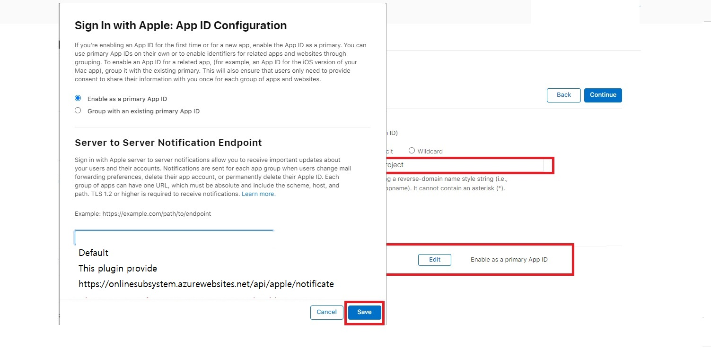

 ### Register App Id
 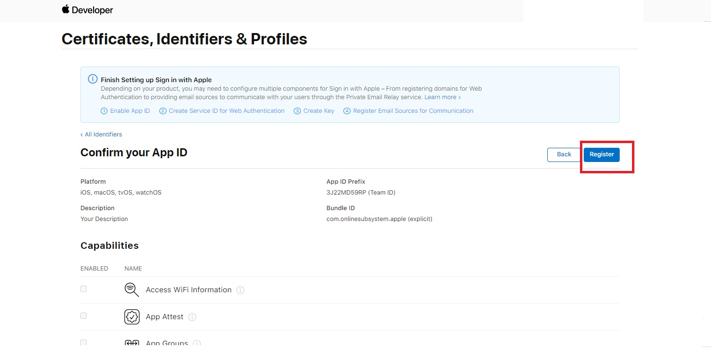

# Step2 - Create Service Id
 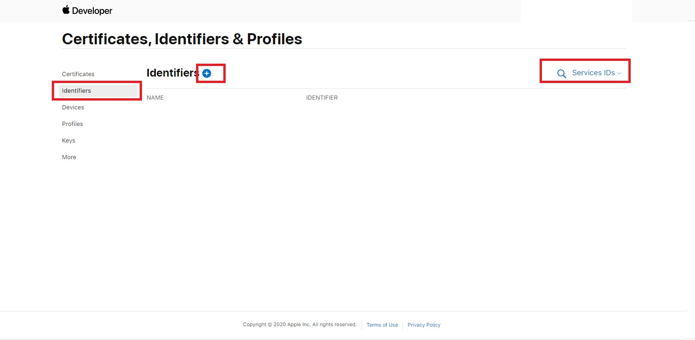

 Select Services IDs and Countinue
 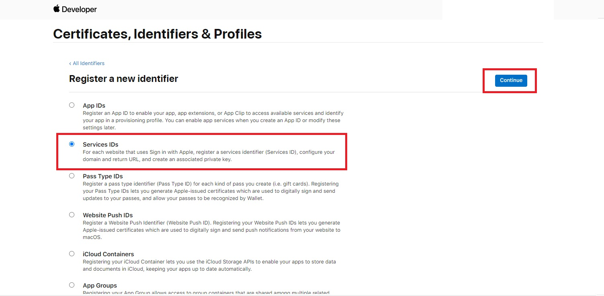

 ### Edit Description.
 ### Edit your Identifier. example [com.onlinesubsystem.apple.service]
 ### THIS IDENTIFIER IS ClientId
 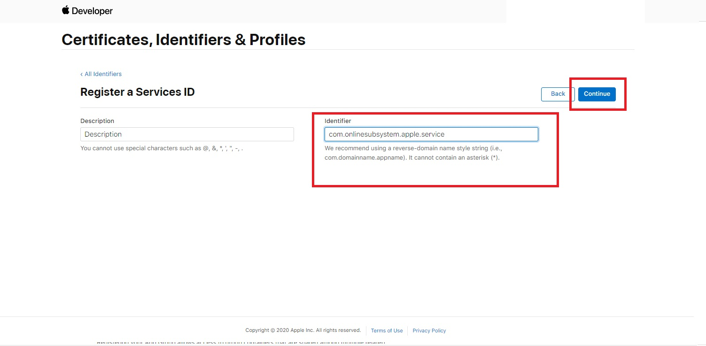

 ### Check Sign In with Apple. And Configure.
 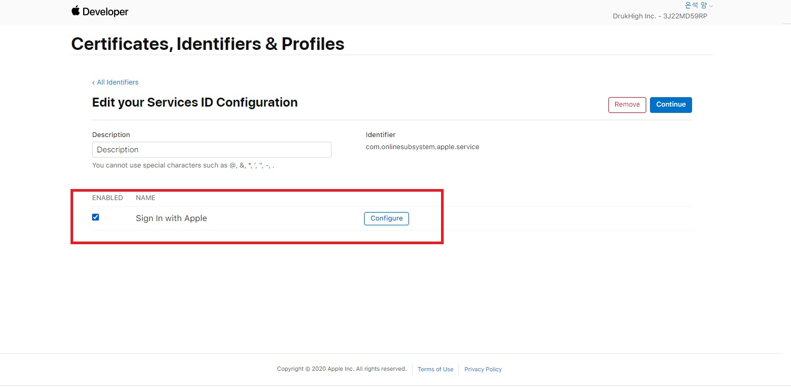

 ### 1. Check Step1 AppId.
 ### 2. Edit Domains.
 ### 3. Edit Return URLs. This PlugIn provide default ReturnURL. "https://onlinesubsystem.azurewebsites.net/api/apple/Redirect"
 ### 4. Click Next.
 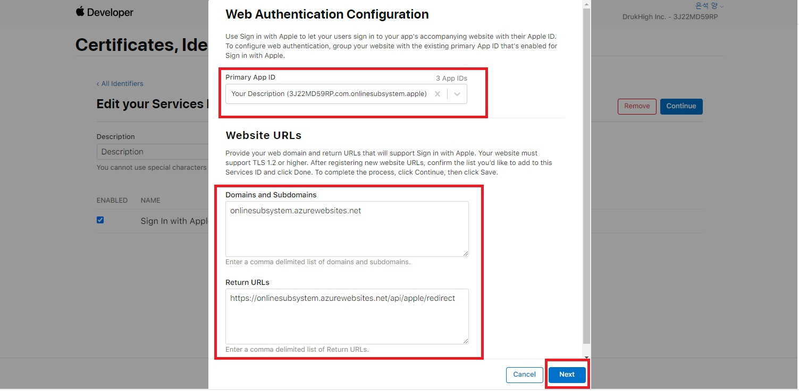

 Continue and Register.
 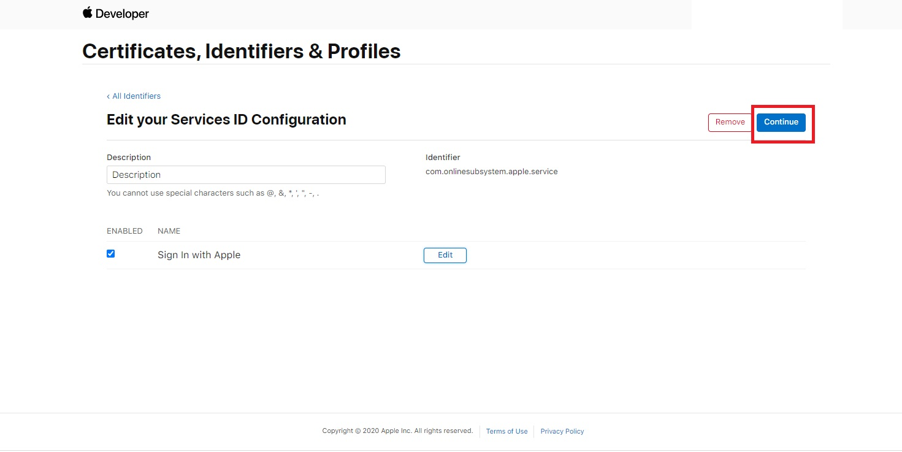

# Done. 
  This PlugIn Provide simple ASP.net core Backend Server with source code. You can customize ReturnURL. 
  Remember Step2 Apple Service IDs Indentifier is ClientId in DefaultEngine.ini
